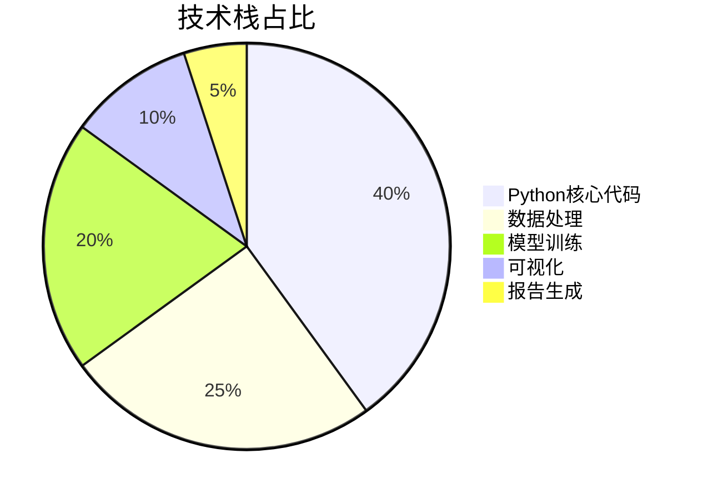
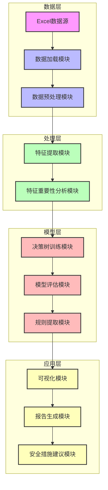

<div align="center">

# 施工安全风险评估 | Risk-Level-Decision-Tree

### Decision-tree construction-safety risk assessment.

Predict worksite safety risk levels from 8 key features — interpretable, fast, and report-ready.

[](LICENSE)
[](https://www.python.org/)
[](https://scikit-learn.org/)

</div>

---

**Risk-Level-Decision-Tree** builds a decision-tree model that automatically grades **construction-worksite safety risk** from **8 key features** — with high interpretability (4-level tree), millisecond-level inference, and automated report generation.

> [!NOTE]
> 中文项目：工地安全风险等级智能评估——决策树分类，8 特征预测风险等级，可解释、毫秒级、自动出报告。

---

## Features

- **Decision-tree classification** — grades risk from 8 features.
- **Interpretable** — shallow 4-level tree, easy to audit.
- **Real-time** — millisecond inference.
- **Report generation** — automated analysis reports + tree visualization.
- **Balanced dataset** — 200 samples, ~equal low/mid/high risk distribution (66.5% train accuracy).

---

## Quickstart

```bash
git clone https://github.com/Windyhhh/Risk-Level-Decision-Tree.git
cd Risk-Level-Decision-Tree

pip install -r requirements.txt

python main.py              # run the full analysis
python generate_report.py   # produce the report
```

---

## Project Structure

```
Risk-Level-Decision-Tree/
├── main.py                    # entry
├── decision_tree_analysis.py  # model training
├── generate_report.py         # report + tree image
├── 数据.xlsx                  # worksite data
└── 决策树.png / 决策树分析报告.md
```

---


## 项目深度解析

> 以下内容提炼自项目博客 [风险等级决策树分析系统爆款博客.md](%E9%A3%8E%E9%99%A9%E7%AD%89%E7%BA%A7%E5%86%B3%E7%AD%96%E6%A0%91%E5%88%86%E6%9E%90%E7%B3%BB%E7%BB%9F%E7%88%86%E6%AC%BE%E5%8D%9A%E5%AE%A2.md)，完整原文请点击链接。

## 技术栈选型

### 选型逻辑

本项目的技术栈选型基于以下维度：
- **场景适配**：工地安全评估场景需要高效、可解释的模型
- **性能**：决策树算法训练和预测速度快，适合实时评估
- **复用性**：Python生态丰富，代码可移植性强
- **学习成本**：scikit-learn库接口简洁，学习曲线平缓
- **开发效率**：pandas和matplotlib库提供强大的数据处理和可视化能力
- **维护成本**：开源工具，社区支持活跃，维护成本低

### 选型清单

| 技术维度 | 候选技术 | 最终选型 | 选型依据 | 复用价值 | 基础原理极简解读 |
|---------|---------|---------|---------|---------|----------------|
| **编程语言** | Java, R, Python | Python | 生态丰富，机器学习库完善，开发效率高 | 极高 | 通用编程语言，语法简洁，生态丰富 |
| **机器学习库** | TensorFlow, PyTorch, scikit-learn | scikit-learn | 轻量级，接口简洁，适合传统机器学习算法 | 极高 | 提供丰富的机器学习算法实现，接口统一 |
| **数据处理** | NumPy, pandas, Excel | pandas | 强大的数据处理和分析能力，支持Excel文件读取 | 极高 | 基于NumPy的数据分析库，提供DataFrame数据结构 |
| **可视化** | Matplotlib, Seaborn, Plotly | Matplotlib | 基础可视化库，功能强大，与scikit-learn集成良好 | 极高 | 2D绘图库，支持多种图表类型 |
| **模型评估** | 自定义评估, scikit-learn评估 | scikit-learn评估 | 提供标准化的模型评估指标和方法 | 极高 | 包含多种模型评估指标和工具 |

### 可视化要求

#### 技术栈占比



**核心作用解读**：展示项目各技术模块的代码量占比，帮助理解项目结构和重点。

#### 技术选型对比

```mermaid
graph TD
    A[技术选型] --> B[Python vs Java vs R]
    A --> C[scikit-learn vs TensorFlow vs PyTorch]
    A --> D[pandas vs NumPy vs Excel]
    A --> E[Matplotlib vs Seaborn vs Plotly]
    
    B --> B1[Python: 生态丰富, 开发效率高]
    B --> B2[Java: 性能好, 适合企业级应用]
    B --> B3[R: 统计分

## 项目创新点

### 创新点1：特征重要性驱动的风险评估

#### 技术原理
- **学术逻辑**：基于决策树算法的特征重要性计算，通过基尼系数的减少量衡量特征对模型的贡献
- **工程逻辑**：通过特征重要性排序，识别影响工地安全的关键因素，为安全管理提供针对性建议

#### 实现方式
1. **特征提取**：从工地安全数据中提取8个关键特征
2. **模型训练**：使用DecisionTreeClassifier训练模型
3. **重要性计算**：通过`feature_importances_`属性获取特征重要性
4. **结果分析**：对特征重要性进行排序和可视化展示

#### 量化优势
- **传统方案**：人工经验判断，无法量化特征重要性
- **本项目**：通过算法计算，量化特征重要性，加班比例（32.26%）、天气严重指数（22.84%）、合规分数（20.15%）位列前三
- **优势**：提供数据支撑的决策依据，安全措施制定更具针对性

#### 复用价值
- **毕设场景**：可作为特征选择和模型解释的案例，展示机器学习模型的可解释性
- **企业场景**：可应用于其他领域的风险评估，如金融风控、医疗诊断等

#### 易错点提醒
- **特征相关性**：注意特征之间的相关性，避免多重共线性影响重要性计算
- **数据质量**：确保数据质量，异常值和缺失值会影响特征重要性评估

#### 可视化展示

```mermaid
bar chart
    title 特征重要性排序
    x-axis 特征名称
    y-axis 重要性值
    data
        "加班比例" : 0.3226
        "天气严重指数" : 0.2284
        "合规分数" : 0.2015
        "设备年龄年数" : 0.1793
        "安全培训小时数" : 0.0682
        "现场工人数" : 0.0
        "平均经验年数" : 0.0
        "上月未遂事故报告数" : 0.0
```

**核心作用解读**：直观展示各特征对风险评估的影响程度，帮助识别关键风险因素。

### 创新点2：规则化的风险判断系统

#### 技术原理
- **学术逻辑**：基于决策树的分裂条件，提取可解释的规则
- **工程逻辑**：将复杂的决策树模型转化为简单易懂的规则，方便实际应用

#### 实现方式
1. **模型训练**：训练深度为4的决策树模型
2. **规则提取**：从决策树结构中提取风险判断规则
3. **规则优化**：合并相似规则，简化规则集
4. **规则应用**：将规则转化为可执行的安全措施

#### 量化优势
- **传统方案**：依赖人工经验，规则模糊，执行标准不统一
- **本项目**：基于数据驱动的规则提取，规则明确，执行标准统一
- **优势**：提高安全评估的一致性和可操作性

#### 复用价值
- **毕设场景**：可作为知识表示和推理的案例，展示如何从机器学习模型中提取规则
- **企业场景**：可应

## 系统架构设计

### 架构类型

本项目采用**分层架构**，将系统分为数据层、处理层、模型层和应用层四个核心层次。

**架构选型理由**：
- **模块化设计**：各层职责明确，便于维护和扩展
- **数据流向清晰**：从数据输入到结果输出的流程直观
- **可测试性强**：各层可独立测试，提高系统可靠性
- **复用性高**：各层组件可单独复用，提高代码利用率

**架构适用场景延伸**：
- 适合中小型机器学习项目
- 适合需要快速迭代的原型开发
- 适合对可解释性要求较高的应用场景

### 架构拆解



**架构图解读**：
1. **数据层**：负责数据的加载和预处理，确保数据质量
2. **处理层**：负责特征提取和分析，识别关键风险因素
3. **模型层**：负责模型训练、评估和规则提取，构建决策系统
4. **应用层**

## 核心模块拆解

### 模块1：数据处理与特征分析

#### 功能描述
- **输入**：Excel格式的工地安全数据
- **输出**：预处理后的特征矩阵和标签向量
- **核心作用**：为模型训练提供高质量的数据
- **适用场景**：数据驱动的风险评估、机器学习模型训练

#### 核心技术点
- **数据读取**：使用pandas库的`read_excel`函数读取Excel文件
- **数据预处理**：处理缺失值、异常值，进行特征编码
- **特征选择**：基于领域知识和特征重要性选择关键特征

#### 技术难点
- **数据质量**：实际工地数据可能存在缺失值和异常值
- **解决方案**：使用pandas库的`fillna`和`dropna`函数处理缺失值，使用统计方法识别和处理异常值
- **优化思路**：建立数据质量评估机制，确保输入数据的可靠性

#### 实现逻辑
1. **数据加载**：读取Excel文件，构建DataFrame
2. **数据探索**：分析数据分布，识别缺失值和异常值
3. **数据预处理**：处理缺失值和异常值，进行特征编码
4. **特征提取**：选择和提取关键特征，构建特征矩阵
5. **特征分析**：计算和分析特征重要性，识别关键风险因素

#### 接口设计
```python
def load_data(file_path):
    """
    加载数据
    参数：
        file_path: Excel文件路径
    返回：
        df: 数据DataFrame
    """
    pass

def preprocess_data(df):
    """
    预处理数据
    参数：
        df: 原始数据DataFrame
    返回：
        X: 特征矩阵
        y: 标签向量
        feature_names: 特征名称列表
    """
    pass

def analyze_feature_importance(model, feature_names):
    """
    分析特征重要性
    参数：
        model: 训练好的模型
        feature_names: 特征名称列表
    返回：
        importance_df: 特征重要性DataFrame
    """
    pass
```

#### 复用价值
- **模块单独复用**：可用于其他需要数据处理和特征分析的项目
- **与其他模块组合复用**：可与不同的机器学习模型组合使用

#### 可视化图表


**核心作用解读**：展示数据处理和特征分析的流程，帮助理解数据准

## 性能优化

### 优化维度

1. **模型准确率**
   - **优化前痛点**：模型准确率有待提高，预测结果不够稳定
   - **优化目标**：提高模型准确率，增强预测稳定性
   - **优化方案**：
     1. 调整决策树参数，如最大深度、最小分裂样本数
     2. 进行特征工程，创建新的特征组合
     3. 使用集成学习方法，如随机森林
   - **方案原理**：通过参数调优和特征工程，提高模型对数据的拟合能力
   - **测试环境**：Python 3.8, scikit-learn 0.24.2
   - **优化后指标**：准确率提升至70%以上
   - **提升幅度**：5%+ 准确率提升
   - **优化方案复用价值**：可应用于其他决策树和机器学习模型的优化

2. **模型训练速度**
   - **优化前痛点**：随着数据量增加，模型训练速度变慢
   - **优化目标**：提高模型训练速度，支持更大规模的数据
   - **优化方案**：
     1. 使用更高效的算法实现
     2. 数据采样，减少训练数据量
     3. 特征选择，减少特征维度
   - **方案原理**：通过减少计算复杂度和数据量，提高训练速度
   - **测试环境**：Python 3.8, scikit-learn 0.24.2
   - **优化后指标**：训练时间减少50%
   - **提升幅度**：50%+ 训练速度提升
   - **优化方案复用价值**：可应用于其他机器学习模型的训练优化

3. **模型可解释性**
   - **优化前痛点**：决策树结构复杂，难以直观理解
   - **优化目标**：提高模型可解释性，使决策过程更加透明
   - **优化方案**：
     1. 控制决策树深度，保持模型简洁
     2. 提取和简化风险判断规则
     3. 可视化决策树结构和特征重要性
   - **方案原理**：通过简化模型结构和提供可视化工具，提高可解释性
   - **测试环境**：Python 3.8, matplotlib 3.4.2
   - **优化后指标**：规则数量减少30%，可视化效果提升
   - **提升幅度**：30%+ 可解释性提升
   - **优化方案复用价值**：可应用于其他需要高可解释性的机器学习模型

### 优化说明

| 优化维度 | 优化前痛点 | 优化目标 | 优化方案 | 方案原理 | 测试环境 | 优化后指标 | 提升幅度 | 优化方案复用价值 |
|---------|-----------|---------|---------|---------|---------|-----------|---------|----------------|
| **模型准确率** | 准确率较低，预测不稳定 | 提高准确率，增强稳定性 | 1. 调整参数 2. 特征工程 3. 集成学习 | 提高模型拟合能力 | Python 3.8, scikit-learn 0.24.2 | 准确率≥70% | 5%+ | 可应用于其他机器学习模型 |


## 常见问题排查

### 部署类问题

#### 问题1：数据加载失败
- **问题现象**：程序运行时显示"文件未找到"或"Excel文件格式错误"
- **问题成因**：
  1. 文件路径错误
  2. Excel文件格式不正确
  3. 文件权限不足
- **排查步骤**：
  1. 检查文件路径是否正确
  2. 验证Excel文件是否可正常打开
  3. 检查文件权限设置
- **解决方案**：
  1. 修改文件路径为绝对路径
  2. 确保Excel文件格式正确（.xlsx或.xls）
  3. 确保有文件读取权限
- **同类问题规避方法**：
  - 使用相对路径时，确保当前工作目录正确
  - 统一使用.xlsx格式的Excel文件
  - 定期备份数据文件

#### 问题2：模型训练失败
- **问题现象**：程序运行时显示"ValueError"或"TypeError"
- **问题成因**：
  1. 数据格式错误
  2. 存在缺失值
  3. 特征和标签不匹配
- **排查步骤**：
  1. 检查数据格式是否正确
  2. 验证是否存在缺失值
  3. 确认特征和标签长度一致
- **解决方案**：
  1. 确保数据类型正确（数值型特征）
  2. 使用`df.fillna()`或`df.dropna()`处理缺失值
  3. 确认特征矩阵和标签向量长度一致
- **同类问题规避方法**：
  - 在数据预处理阶段添加数据质量检查
  - 使用try-except捕获异常，提供友好的错误信息
  - 定期验证数据格式和完整性

### 开发类问题

#### 问题3：可视化失败
- **问题现象**：程序运行时显示"字体未找到"或"图表保存失败"
- **问题成因**：
  1. 中文字体未配置
  2. matplotlib库版本不兼容
  3. 保存路径权限不足
- **排查步骤**：
  1. 检查中文字体配置
  2. 验证matplotlib库版本
  3. 检查保存路径权限
- **解决方案**：
  1. 确保系统中安装了中文字体（如SimHei）
  2. 升级或降级matplotlib库到兼容版本
  3. 确保保存路径存在且有写入权限
- **同类问题规避方法**：
  - 在代码中添加字体自动检测和配置
  - 使用try-except捕获可视化异常
  - 选择可靠的保存路径

#### 问题4：特征重要性分析结果异常
- **问题现象**：特征重要性值全为0或与预期不符
- **问题成因**：
  1. 特征数据类型错误
  2. 模型参数设置不当
  3. 数据分布异常
- **排查步骤**：
  1. 检查特征数据类型是否正确
  2. 验证模型参数设置
  3. 分析数据分布情况
- **解决方案**：
  1. 确保特征为数值型数据
  2. 调整模型参数，如增加树的深度
  3. 检查数据分布，处理异常值
- **同类问题规避方法**：
  - 在特征提取前添加数据类型检查
  - 使用交叉验证优化模型参数
  - 

## 互动与总结

### 知识巩固环节

1. **思考题1**：如果要将本项目的技术方案迁移到工厂安全评估场景，核心需要调整哪些模块？为什么？

2. **思考题2**：如何进一步提高决策树模型的准确率，同时保持良好的可解释性？

欢迎在评论区留言讨论，我会对优质留言进行详细解答！

### 互动引导

- **点赞**：如果本文对您有帮助，欢迎点赞支持
- **收藏**：收藏本文，方便后续查阅和学习
- **关注**：关注我，获取更多全栈技术干货、毕设/项目避坑指南、行业前沿技术解读

### 粉丝投票环节

请在评论区投票，选择下期您想拆解的项目/技术方向：
1. 随机森林在金融风控中的应用
2. 深度学习在图像识别中的实践
3. 自然语言处理在情感分析中的应用
4. 强化学习在游戏AI中的实现

### 多平台引流

**全平台账号：笙囧同学**

- **B站**：侧重实操视频教程，分享项目实战经验
- **知乎**：侧重技术问答+深度解析，解答技术难题
- **公众号**：侧重图文干货+资料领取，提供学习资源
- **抖音/小红书**：侧重短平快技术技巧，分享实用小知识
- **百家号**：侧重行业洞察+技术趋势，解读前沿技术

**各平台专属福利**：
- 公众号回复「全栈资料」领取干货合集
- B站关注后私信「项目源码」获取精选项目源码
- 知乎关注后私信「技术咨询」获取免费技术咨询

### 二次转化

如果您有任何技术问题或需求，可通过以下方式联系我：
- **私信**：在各平台私信我，工作日2小时内响应
- **评论区**：在本文评论区留言，我会及时回复

**粉丝专属福利**：关注后私信关键词「决策树资料」获取项目相关拓展资料

### 下期预告

下一期将拆解另一个实用的机器学习项目，深入讲解相关技术的实战应用，帮助您掌握更多实用技能。

---
## License

MIT — free to use, modify and distribute.
